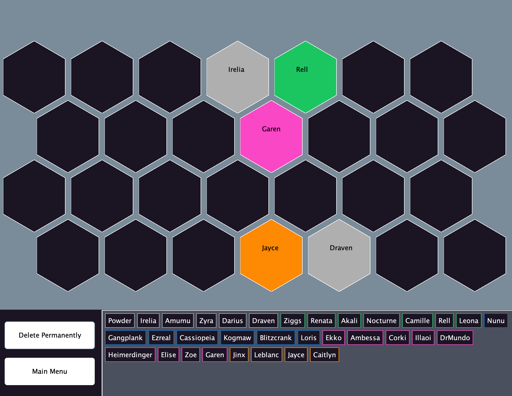

<h1 align="center" id="title">Teamfight Tactics Board Planner</h1>

A quick and easy Java Swing application for Riot's auto battler game TFT.

<h2>Project Screenshots:</h2>

  
  
<h2>🧐 Features</h2>

Here're some of the project's best features:

*   Sets are stored as JSON for inter-replaceable sets
*   Auto-data persistence for session replayability
*   Intuitive AI with similar in-game controls
*   Under-the-hood action logging

  
  
<h2>💻 Built with</h2>

Technologies used in the project:

*   Java
*   JUnit
*   Java Swing Library

 

 